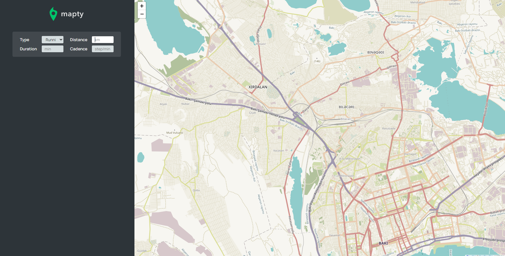

# MAPTY Application

Workout tracker application

### Usage

You have a small sidebar here on the left side. And then the main part of the application is the huge map. This map is actually loaded, from a third party service called Leaflet.

And also the position is actually automatically obtained by the browser using Geolocation API. When you click "Allow", JavaScript will fetch your position, and it will then also load the map on your current position. The goal of this application is to log your workouts.

When you click somewhere on the map, the form will show up in the sidebar and you can input your workout details. After filling the form inputs you click enter and it will print the workout on the sidebar, also a nice pop up will be pinned in the map

Another thing that is special here, when we close this app and reload it, it will basically keep its state.

## Technologies and Libraries Used

- HTML
- CSS
- Javascript
- **[Geolocation API](https://developer.mozilla.org/en-US/docs/Web/API/Geolocation_API)**
- **[Leaflet](https://leafletjs.com/)**
- **[localStorage API](https://developer.mozilla.org/en-US/docs/Web/API/Window/localStorage)**

To view a live example, **[click here](https://mapty-app-go.netlify.app/)**.
